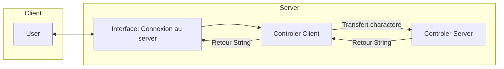
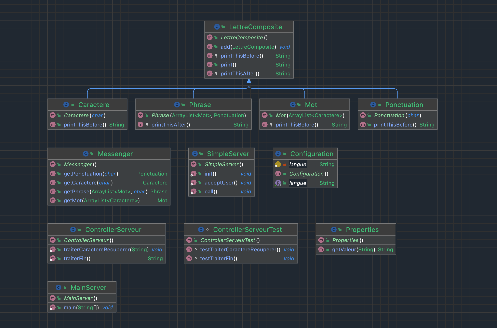
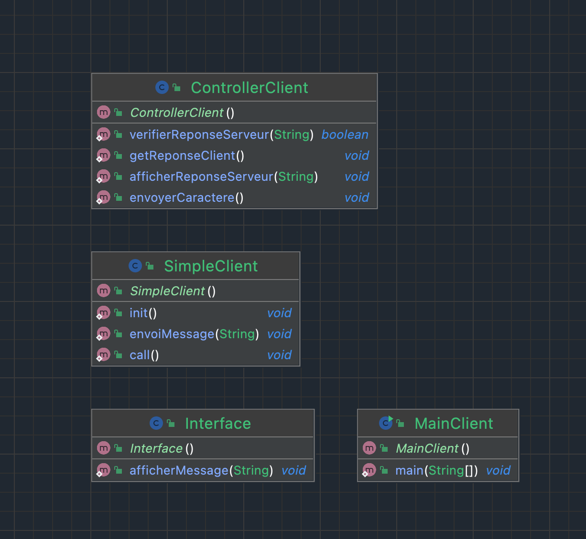

# L3 OOP --> I/O Key
Repository for _Raphaël Pilleux_, _Ilan Rubinsohn_ & _Ryan Danion_.

```mermaid
flowchart LR
    subgraph Client
        User
    end
    subgraph Server
        i[Interface: Connexion au server]
        cc[Controler Client]
        cs[Controler Server]
    end
    User <--> i
    i --> cc
    cc -- Transfert charactere --> cs 
    cs -- Retour String  --> cc
    cc -- Retour String --> i 
```

## Model Server

## Model Client
